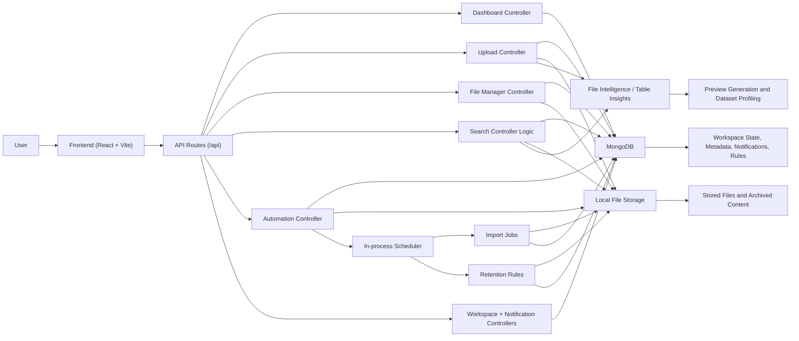

# SK DataForge

SK DataForge is a full-stack workspace for uploading, organizing, searching, previewing, and automating file collections with a strong focus on table data. It combines a React frontend, an Express API, MongoDB-backed metadata, and filesystem storage for uploaded assets.

The project is designed for teams that need more than a basic file drop area. It supports dataset previews, lightweight data profiling, duplicate detection, workspace quota monitoring, notifications, folder-based file management, and scheduled ingestion and retention workflows.

## Highlights

- Upload and manage spreadsheets, CSVs, documents, images, media, archives, code, and text files.
- Organize content in folders with rename, move, copy, delete, tagging, and bulk operations.
- Search across folder names, file metadata, and file content for table and text-like files.
- Preview files inline, including dataset/table previews with generated insights.
- Detect duplicate content using SHA-256 content hashing.
- Track workspace quota usage and generate notifications for important events.
- Configure scheduled import sources and retention rules.
- Export table previews back to CSV or XLSX.

## Core Product Capabilities

### 1. Workspace Dashboard

The dashboard aggregates workspace-level operational data, including:

- total folders and files
- recent upload activity
- file-type analytics
- storage consumption and remaining capacity
- upload trend summaries
- recent files and largest files

This makes the app usable as both a file workspace and a lightweight operational view over stored datasets.

### 2. Upload and Ingestion

Users can upload files into workspace folders from the frontend. On upload, the backend:

- validates file support
- sanitizes file and folder names
- writes files to the local upload root
- records metadata in MongoDB
- computes content hashes for duplicate detection
- enforces workspace quota limits
- emits notifications for success, replacement, duplicates, and failures

The automation layer also supports scheduled ingestion from:

- direct URL sources
- local folder sources

Additional provider types such as Google Drive, OneDrive, SharePoint, S3, and Azure Blob are modeled in the schema and UI contract, but automated execution is currently implemented only for direct URL and local-folder sources.

### 3. File Manager

The file manager provides folder-tree navigation and workspace operations such as:

- create, rename, move, copy, and delete folders
- rename, move, copy, and delete files
- bulk move, delete, tag, download, and export
- duplicate-file grouping
- breadcrumb navigation and folder tree browsing

### 4. Search

Global search supports:

- folder name matching
- file name and metadata matching
- optional content-aware search for table and text-like files
- result snippets for matched content

For table files, searchable content is derived from spreadsheet headers and rows. For text-like files, raw file text is indexed at request time.

### 5. File Preview and Table Intelligence

The preview flow is one of the stronger parts of the project.

Supported preview modes include:

- tables
- plain text / code-like files
- images
- PDFs
- audio and video
- documents with download/open fallback
- archives with metadata-only fallback

For spreadsheets and tabular files, the backend generates structured insights such as:

- row and column counts
- populated versus missing cells
- duplicate row detection
- inferred column types
- fill-rate analysis
- top values
- numeric ranges and averages
- date ranges
- boolean breakdowns
- lightweight trend blocks

This gives the app a data-profiling layer, not just a file preview layer.

### 6. Automation and Retention

The backend includes a scheduler that runs on a fixed interval and executes:

- import jobs for active ingestion sources
- retention rules for archive or delete actions

Retention rules can target:

- a specific folder subtree
- files older than a configured number of days
- optional tag-based filters

Archived files are moved under an `_archive` path, while delete actions remove both the file on disk and its metadata record.

### 7. Notifications and Quota Awareness

The system stores workspace notifications for events such as:

- upload failures
- completed processing
- duplicate detection
- new file version uploads
- scheduled ingestion failures or completions
- quota-related warnings

Workspace settings are persisted in MongoDB and include quota size, warning thresholds, admin label, and workspace name.

## Tech Stack

### Frontend

- React 18
- TypeScript
- Vite
- React Router
- Tailwind CSS

### Backend

- Node.js
- Express
- TypeScript
- Mongoose
- Multer
- XLSX
- Archiver

### Storage

- MongoDB for metadata, automation rules, notifications, and workspace settings
- Local filesystem for uploaded file content

## Repository Structure

```text
.
|-- backend/
|   |-- src/
|   |   |-- config/
|   |   |-- constants/
|   |   |-- controllers/
|   |   |-- models/
|   |   |-- routes/
|   |   |-- services/
|   |   `-- utils/
|   |-- package.json
|   `-- tsconfig.json
|-- frontend/
|   |-- src/
|   |   |-- components/
|   |   |-- lib/
|   |   `-- pages/
|   |-- package.json
|   `-- vite.config.ts
|-- package.json
`-- README.md
```

## Project Flowchart



## Available Scripts

### Root

```bash
npm run dev:frontend
npm run dev:backend
npm run build:frontend
npm run build:backend
```

### Backend

```bash
npm run dev --prefix backend
npm run build --prefix backend
npm run start --prefix backend
```

### Frontend

```bash
npm run dev --prefix frontend
npm run build --prefix frontend
npm run preview --prefix frontend
```

## API Overview

Main API groups exposed under `/api`:

- `GET /dashboard`
- `GET /health`
- `GET /notifications`
- `POST /notifications/read-all`
- `GET /workspace`
- `PATCH /workspace`
- `GET /automation`
- `POST /automation/sources`
- `POST /automation/sources/:sourceId/run`
- `POST /automation/rules`
- `POST /automation/rules/:ruleId/run`
- `GET /uploads/folders`
- `POST /uploads`
- `GET /uploads/files/:fileId/content`
- `GET /uploads/files/:fileId/export`
- `GET /uploads/files/:fileId/preview`
- `GET /search`
- `GET /manager`
- `GET /manager/duplicates`
- `GET /manager/folders/:folderId`
- `POST /manager/folders`
- `PATCH /manager/folders/:folderId/rename`
- `DELETE /manager/folders/:folderId`
- `POST /manager/folders/:folderId/move`
- `POST /manager/folders/:folderId/copy`
- `PATCH /manager/files/:fileId/rename`
- `DELETE /manager/files/:fileId`
- `POST /manager/files/:fileId/move`
- `POST /manager/files/:fileId/copy`
- bulk manager endpoints for move, delete, tag, download, and export

## Data Model Summary

Key MongoDB models in the current implementation:

- `Folder`
- `UploadedFile`
- `WorkspaceSettings`
- `Notification`
- `ImportSource`
- `RetentionRule`

Important implementation details:

- files are uniquely constrained by `folderId + name`
- folders are uniquely constrained by `parentId + name`
- duplicate detection uses a SHA-256 `contentHash`
- file lifecycle supports `active` and `archived`

## What Makes This Project Valuable

This repository is stronger than a standard upload manager because it combines:

- file storage
- metadata management
- workspace operations
- content-aware search
- table intelligence
- quota monitoring
- automation

That combination makes it suitable for internal data operations, document workspaces, reporting repositories, and lightweight dataset governance use cases.

## Current Gaps and Practical Limitations

The codebase is functional, but the current version still has some product and engineering gaps:

- there is no authentication or authorization layer yet
- the upload content is stored on the local filesystem rather than object storage
- some provider types are modeled but not fully implemented for automated ingestion
- search is request-time and file-based, not backed by a dedicated indexing engine
- there is no test suite configured in the repository at the moment
- deployment and containerization assets are not included yet

These are worth addressing if the project is intended for production or multi-tenant usage.

## Recommended Next Improvements

- add authentication and role-based access control
- move file storage to S3, Azure Blob, or another managed object store
- add background job infrastructure instead of relying on in-process intervals
- introduce automated tests for upload, search, preview, and retention flows
- add Docker support and deployment documentation
- add richer connector implementations for cloud storage providers
- add persistent search indexing for larger datasets

## Status

The current repository represents a solid MVP for a smart file workspace centered on data-heavy files. It already demonstrates a good separation between frontend, API, persistence, and filesystem concerns, and it includes several useful product-level behaviors beyond CRUD.

If this project is being showcased on GitHub, this README should position it clearly as a data workspace and file intelligence platform rather than only a file uploader.
